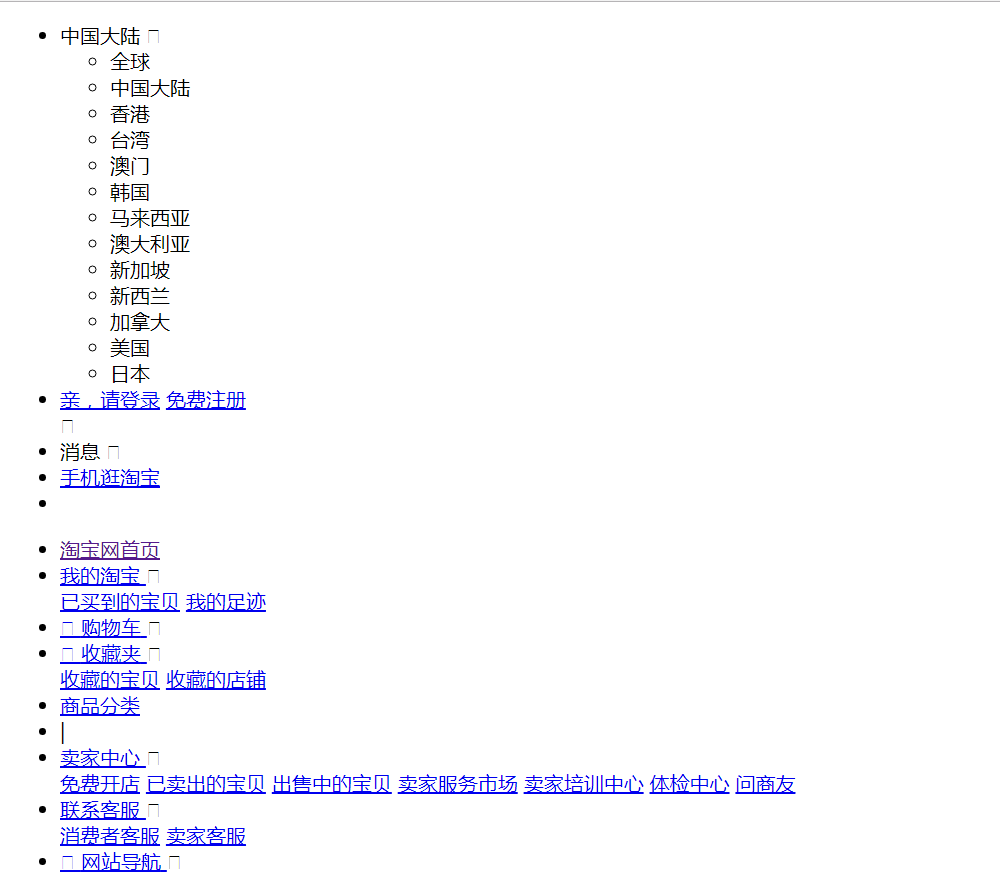

# 课程目标
- 了解Css是什么以及作用
- 掌握Css的三种引用方式
- 掌握Css样式规则（语法）
- 熟记CSS字体样式属性

# Css介绍
## Css的产生
从HTML被发明开始，样式就以各种形式存在。不同的浏览器结合它们各自的样式语言为用户提供页面效果的控制。最初的HTML只包含很少的显示属性。

随着HTML的成长，为了满足页面设计者的要求，HTML添加了很多显示功能。但是随着这些功能的增加，HTML变的越来越杂乱，而且HTML页面也越来越臃肿。于是CSS便诞生了。

> 案例演示：html里面的样式属性

## 网页的美容师

CSS的出现，拯救了混乱的HTML，更加拯救了我们web开发者。 让我们的网页更加丰富多彩。

CSS的最大贡献就是：让 HTML 从样式中解脱苦海，实现了 HTML 专注去做结构呈现。 

**这就是我们之前常说的结构、表现、行为相分离。**


有人说， 没有不漂亮的女人，只有不会打扮的女人。

我想说， 没有不好看的网页，只有不会CSS的前端。

**网页添加 CSS和不添加CSS 的对比：**

带有CSS的页面


没有CSS的页面



## Css层叠样式表
CSS(Cascading Style Sheets)

CSS通常称为CSS样式表或层叠样式表（级联样式表），主要用于设置HTML页面中的文本内容（字体、大小、对齐方式等）、图片的外形（宽高、边框样式、边距等）以及版面的布局等外观显示样式。

CSS以HTML为基础，提供了丰富的功能，如字体、颜色、背景的控制及整体排版等，而且还可以针对不同的浏览器设置不同的样式。

# Css样式规则（语法）
使用HTML时，需要遵从一定的规范。CSS亦如此，要想熟练地使用CSS对网页进行修饰，首先需要了解CSS样式规则，具体格式如下：                                          


在上面的样式规则中:

1. 选择器用于指定CSS样式作用的HTML对象，花括号内是对该对象设置的具体样式。
2. 属性和属性值以“键值对”的形式出现。
3. 属性是对指定的对象设置的样式属性，例如字体大小、文本颜色等。
4. 属性和属性值之间用英文“:”连接。
5. 多个“键值对”之间用英文“;”进行区分。

> 案例演示：Css样式的规则

# Css的引入方式

## 行内样式
在html的标签中使用style属性为元素定义样式
```
<p style="color: red;">这是一个段落</p>
```

## 内部样式
在head中使用`<style>`标签为元素定义样式
```
<head>
  <style type="text/css">
    p {color: red;}
  </style>
</head>
<body>
<p>这是一个段落</p>
</body>
```
**属性**：
- type="text/css" 文档类型为"文本/层叠样式表"

## 外部样式
在head中使用`<link>`标签链接一个外部样式表
```
<head>
<link href="style.css" rel="stylesheet" type="text/css" />
</head>
```
**属性**：
- href="style.css" 链接外部样式文件。
- type="text/css" 文档类型为"文本/层叠样式表"。
- rel="stylesheet" 描述当前页面与href所链接文档的关系，即：href连接的文档是一个样式表。

## 浏览器样式
浏览器本身也对部分标签设置了某些特殊样式，比如h1、p标签等

浏览器自带样式各不相同，实际应用中通常会重置浏览器自带的标签样式
```
<style type=”text/css”>
  a{text-decoration: none;}
</style>
```
## 样式的优先级
样式引入方式的优先级如下：

1. 行内样式优先级最高
2. style标签和link标签，谁后声明，谁的优先级最高
3. 浏览器的内置样式优先级最低

> 案例演示：Css样式的优先级

# CSS字体样式属性

## font-size:字号大小

font-size属性用于设置字号，该属性的值可以使用相对长度单位，也可以使用绝对长度单位。其中，相对长度单位比较常用，推荐使用像素单位px，绝对长度单位使用较少。具体如下：


## font-family:字体

font-family属性用于设置字体。网页中常用的字体有宋体、微软雅黑、黑体等  
例如将网页中所有段落文本的字体设置为宋体（SimSun），可以使用如下CSS样式代码：
```
p { font-family:SimSun;}
```

**字体名称**：

在 CSS 中设置字体名称，直接写中文是可以的。但是在文件编码（GB2312、UTF-8 等）不匹配时会产生乱码的错误。xp 系统不支持 类似微软雅黑的中文。

方案一： 你可以使用英文来替代。 比如 font-family:"Microsoft Yahei"。

方案二： 在 CSS 直接使用 Unicode 编码来写字体名称可以避免这些错误。使用 Unicode 写中文字体名称，浏览器是可以正确的解析的。表示设置字体为“微软雅黑”：
```
font-family: "\5FAE\8F6F\96C5\9ED1"
```

| 字体名称      | 英文名称            | Unicode 编码           |
| --------- | --------------- | -------------------- |
| 宋体        | SimSun          | \5B8B\4F53           |
| 黑体        | SimHei          | \9ED1\4F53           |
| 微软雅黑      | Microsoft YaHei | \5FAE\8F6F\96C5\9ED1 |
| 新宋体       | NSimSun         | \65B0\5B8B\4F53      |
| 楷体_GB2312 | KaiTi_GB2312    | \6977\4F53_GB2312    |
| 隶书        | LiSu            | \96B6\4E66           |
| 幼园        | YouYuan         | \5E7C\5706           |
| 华文细黑      | STXihei         | \534E\6587\7EC6\9ED1 |
| 细明体       | MingLiU         | \7EC6\660E\4F53      |
| 新细明体      | PMingLiU        | \65B0\7EC6\660E\4F53 |

**多个字体**：

可以同时指定多个字体，中间以逗号隔开，表示如果浏览器不支持第一个字体，则会尝试下一个，直到找到合适的字体。
```
p { font-family:SimSun,"Microsoft YaHei","黑体",\65B0\5B8B\4F53;}
```

## font-weight:字体粗细
字体加粗除了用 b  和 strong 标签之外，可以使用CSS 来实现，但是CSS 是没有语义的。

font-weight属性用于定义字体的粗细，其可用属性值：

- normal 正常。
- bold 粗体。
- bolder 比粗体更加粗。  
- lighter 比正常更细。
- 100~900（100的整数倍）共9个等级。

**技巧：数字 400 等价于 normal，而 700 等价于 bold。但是我们更喜欢用数字来表示。** 

## font-style:字体风格
字体倾斜除了用 i  和 em 标签之外，可以使用CSS 来实现，但是CSS 是没有语义的。

font-style属性用于定义字体风格，如设置斜体、倾斜或正常字体，其可用属性值如下：

- normal：默认值，浏览器会显示标准的字体样式。
- italic：浏览器会显示有斜体的字体的斜体样式。
- oblique：浏览器会让没有斜体属性的文字倾斜。

**技巧：平时我们很少给文字加斜体，反而喜欢给斜体标签（em，i）改为普通模式。**

## font:综合设置字体样式
font属性用于对字体样式进行综合设置，其基本语法格式如下：

选择器 { font: font-style  font-weight  font-size/line-height  font-family;}

```
p { font:italic 400 14px/22px "Microsoft Yahei"; }
```

**注意：**

- 使用font属性时，必须按上面语法格式中的顺序书写，不能更换顺序，各个属性以空格隔开。
- 其中不需要设置的属性可以省略（取默认值），但必须保留font-size和font-family属性，否则font属性将不起作用。