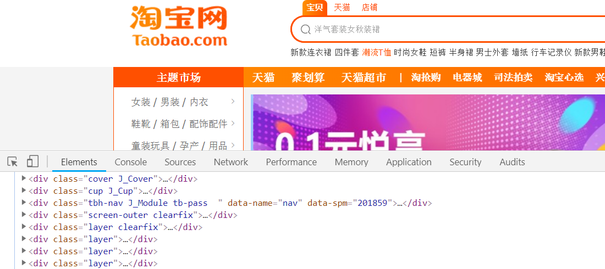
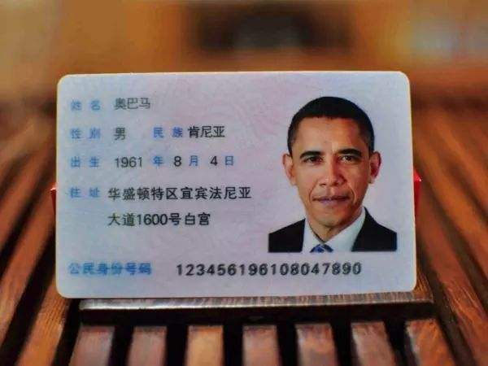

# 课程目标
- 了解选择器的作用
- 熟记三大选择器的语法
- 熟记复合选择器的语法
- 掌握选择器的使用

# Css选择器

要想将CSS样式应用于特定的HTML元素，首先需要找到该目标元素。

在CSS中，执行这一任务的样式规则部分被称为选择器（选择符）。

思考：把班级的同学进行区分，可以采取哪些方式呢？

男、女，学习小组，寝室

# 基本选择器

## 标签选择器

标签选择器是指用<strong style="color:#f00">HTML标签名</strong>称作为选择器，按标签名称分类，为页面中某一类标签指定统一的CSS样式。

其基本语法格式是：标签名 { 属性1:属性值1; 属性2:属性值2; }
```
p { font-size:14px; font-style:italic; }
```
**注意：是选择一类标签，不是选中一个标签**

## 类选择器

类选择器使用<strong style="color:#f00">“.”（英文句号）</strong>进行标识，后面紧跟“类名”。

其基本语法格式如下：.类名 { 属性1:属性值1; 属性2:属性值2; }
```
.classname { font-size:14px; font-style:italic;}
```

**类名**：Html标签的class属性

```
<p class="classname">这是一个段落</p>
```

**命名规范**：

1. 长名称或词组可以使用中横线“-”来为选择器命名。
2. 不建议使用起始使用下划线“_”来命名CSS选择器。
3. 不要纯数字、中文等命名，尽量使用英文字母来表示。

> 附：常用命名对照表

**可以使用多个类名**：我们可以给标签指定多个类名，从而达到更多的选择目的。



**注意**：

1. 各个类名中间用空格隔开。
2. 样式显示效果跟HTML元素中的类名先后顺序没有关系,受CSS样式书写的上下顺序有关。

多类名选择器在后期布局比较复杂的情况下，还是较多使用的。

```
<p class="pink fontWeight font20">亚瑟</p>
<p class="font20">刘备</p>
<p class="font14 pink">安其拉</p>
<p class="font14">貂蝉</p>
```

## ID选择器

ID选择器使用<strong style="color:#f00">“#”（井号）</strong>进行标识，后面紧跟“ID名”。

其基本语法格式如下：#ID名 { 属性1:属性值1; 属性2:属性值2; }
```
#idname { font-size:14px; font-style:italic;}
```

**ID名**：Html标签的id属性
```
<p id="idname">这是一个段落</p>
```

**命名规范**：

与class相同

**只能使用使用一次**：

1. 一个标签只使用一个id
2. 一个页面不能有相同名字的id


## 类与ID的区别

W3C标准规定，在同一个页面内，不允许有相同名字的id对象出现，但是允许相同名字的class。

**id选择器和类选择器最大的不同在于 使用次数上。**



类选择器（class） 好比人的名字，  是可以多次重复使用的， 比如  张伟  王伟  李伟  李娜

id选择器     好比人的身份证号码，  全中国是唯一的， 不得重复。 只能使用一次。

## 通配符选择器

通配符选择器用<strong style="color:#f00">“*”（星号）</strong>表示，他是所有选择器中作用范围最广的，能匹配页面中所有的元素。其基本语法格式如下：

```
* { 属性1:属性值1; 属性2:属性值2; 属性3:属性值3; }
```

例如下面的代码，使用通配符选择器定义CSS样式，清除所有HTML标记的默认边距。

```
* {
  margin: 0;                    /* 定义外边距*/
  padding: 0;                   /* 定义内边距*/
}
```

# 复合选择器
复合选择器是由两个或多个基础选择器，通过不同的方式组合而成的,目的是为了可以选择更准确更精细的目标元素标签。

## 交集选择器

交集选择器由两个选择器构成，其中第一个为标签选择器，第二个为class选择器，两个选择器之间不能有空格，如h3.special。


交集选择器 是 并且的意思。  即...又...的意思

比如：   p.one   选择的是： 类名为 .one  的 段落标签。  

**用的相对来说比较少，不太建议使用。**

## 并集选择器

并集选择器（CSS选择器分组）是各个选择器通过<strong style="color:#f00">逗号</strong>连接而成的，任何形式的选择器（包括标签选择器、class类选择器id选择器等），都可以作为并集选择器的一部分。如果某些选择器定义的样式完全相同，或部分相同，就可以利用并集选择器为它们定义相同的CSS样式。


并集选择器  和 的意思，  就是说，只要逗号隔开的，所有选择器都会执行后面样式。

比如  .one, p , #test {color: #F00;}  表示   .one 和 p  和 #test 这三个选择器都会执行颜色为红色。  通常用于集体声明。


他和他，在一起， 在一起    一起的意思

## 后代选择器

后代选择器又称为包含选择器，用来选择元素或元素组的后代，其写法就是把外层标签写在前面，内层标签写在后面，中间用空格分隔。当标签发生嵌套时，内层标签就成为外层标签的后代。


子孙后代都可以这么选择。 或者说，它能选择任何包含在内 的标签。 


## 子元素选择器

子元素选择器只能选择作为某元素子元素的元素。其写法就是把父级标签写在前面，子级标签写在后面，中间跟一个 &gt; 进行连接，注意，符号左右两侧各保留一个空格。


这里的子 指的是 亲儿子  不包含孙子 重孙子之类。

比如：  .demo > h3 {color: red;}   说明  h3 一定是demo 亲儿子。  demo 元素包含着h3。

## 属性选择器

**获取到拥有该属性的元素**
```
a[target] { color:#f00;}
```

**获取属性等于某个值的元素**
```
input[type="text"] { border:1px solid #f00;}
```
**常使用在选择input控件的各种形态**

# 选择器使用案例

排版文章


 