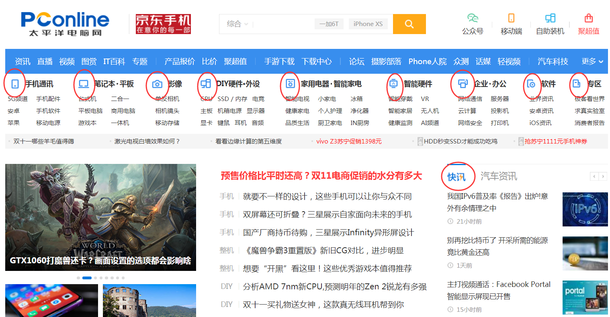
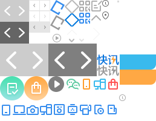

# 课程目标

- 熟练使用背景的各个属性
- 雪碧技术的使用

# Css背景属性

| 属性                  | 属性值                                | 描述                   |
| --------------------- | ------------------------------------- | ---------------------- |
| background-color      | none\|色值                            | 设置背景颜色           |
| background-image      | none\|图片路径                        | 设置背景图片           |
| background-repeat     | repeat\|no-repeat\|repeat-x\|repeat-y | 设置背景图片重复方式   |
| background-attachment | scroll\|fixed                         | 设置背景是否随元素滚动 |
| background-position   | 像素值\|百分数 或者 方位词            | 设置背景图片的显示位置 |
| background            | 颜色 图片 重复 滚动 位置              | 背景简写（常用）       |

## 背景颜色

设置元素的背景颜色。

语法：

```css
background-color : none | 色值
```

参数：

1. none： 无背景颜色
2. 色值：预设词 | 十六进制 |rgb色值 |rgba色值（Css3）

注意：可以为所有元素设置背景色，这包括 body 一直到 em 和 a 等行级元素。 

**背景透明**

可以使用Css3的rgba颜色设置背景透明

```css
div { background: rgba(0,0,0,0.3);}
```

注意：背景透明是指盒子背景半透明， 盒子里面的内容不收影响。

## 背景图像

设置元素的背景图像。

语法： 

```css
background-image : none | url (URL) 
```

参数： 

1. none : 　无背景图（默认值）
2. URL: 　使用绝对或相对地址指定背景图像 

注意： 通常使用相对路径，我们提倡URL不要加引号。

## 背景重复

设置背景图像重复方式

语法： 

```css
background-repeat : repeat | no-repeat | repeat-x | repeat-y 
```

属性值： 

1. repeat : 　背景图像在纵向和横向上重复平铺（默认值）
2. no-repeat : 　背景图像不平铺
3. repeat-x : 　背景图像在横向上平铺
4. repeat-y : 　背景图像在纵向平铺 

注意：一般情况下我们不希望背景图片平铺，所以设置背景图片时，都会使用no-repeat

## 背景附着

设置背景图像是随元素滚动还是固定的。

语法： 

```css
background-attachment : scroll | fixed 
```

参数： 

1. scroll : 　背景图像是随对象内容滚动
2. fixed : 　背景图像固定 

**思考：视差滚动效果**

## 背景定位（难点）

设置背景图片的显示位置。

语法一：方位词

```css
background-position : top | center | bottom 和 left | center | right ;
```

参数：

1. left | center | right ：水平方向左、中、右
2. top | center | bottom：垂直方向上、中、下
3. center：水平和垂直方向都居中

注意：如只设置水平方向或垂直方向一个值，另一方向默认居中

语法二： 像素值 | 百分数

```css
background-position : 水平方向值 垂直方向值 ;
```

1. 水平方向值
2. 垂直方向值

注意：如只设置一个值，默认为水平方向偏移，垂直方向居中

**雪碧技术sprite**


访问网站时，页面上的图片显示都要向服务器发起请求，每使用一张图片，都需要发送一次请求，频繁的请求增加服务器的压力，降低了页面打开的速度。为了减少请求，提高页面的打开速度，出现了CSS雪碧技术。

将网站上使用的背景小图片，整合成一张背景大图，就叫做**雪碧图**。这样用户打开页面时就只发送一次请求，页面中的背景图像就全部显示。

太平洋电脑网：



太平洋电脑网雪碧图：



显示图标“快讯”：

```css
.icon {
    width:37px;
    height:18px;
    background-image:url(images/sprite.png);
    background-repeat:no-repeat;
    background-position:-160px -90px;
}
```

## 背景综合设置（常用）

所有背景属性设置在一个声明之中。

语法：

书写顺序并没有强制标准的。为了可读性，建议大家如下写：

```css
background : color image repeat attachment position;
```

案例：

```css
body { background : yellow url(bg.jpg) no-repeat scroll top left；}
```

注意：一般情况下我们也可以只写颜色、图片、重复

```css
body { background : yellow url(bg.jpg) no-repeat；}
```