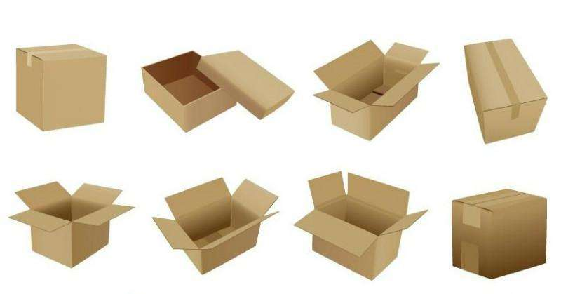
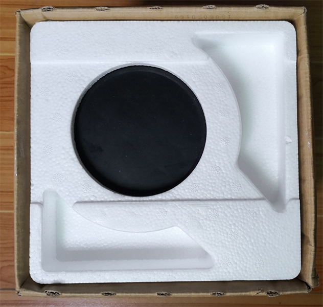

# 课程目标

- 了解盒子模型在网页布局中的作用
- 了解盒子模型的构成
- 熟练掌握边框属性
- 熟练掌握内边距属性
- 熟练掌握外边距属性

# 盒子模型 (Box Model) 


生活中常见的盒子：






所谓盒子模型就是把HTML页面中的元素看作是一个矩形的盒子，也就是一个盛装内容的容器。

每个矩形都由元素的内容、内边距（padding）、边框（border）和外边距（margin）组成。

盒子模型的构成：


| 属性    | 描述         |
| ------- | ------------ |
| width   | 宽           |
| height  | 高           |
| border  | 盒子的边框   |
| padding | 盒子的内边距 |
| margin  | 盒子的外边距 |

# 边框border

盒子模型的边框。边框可以定义宽度、样式和颜色 

| 属性         | 属性值                                           | 描述             |
| ------------ | ------------------------------------------------ | ---------------- |
| border-width | 数值 \| thin \| medium \| thick                  | 边框的粗细       |
| border-style | none\|solid\|dashed\|dotted\|double              | 边框的风格       |
| border-color | 色值                                             | 边框的颜色       |
| border       | border-width \|\| border-style \|\| border-color | 边框属性综合设置 |

## 边框粗细

定义元素边框的粗细。

语法：

```css
border-width : 数值 | thin | medium | thick
```

属性值：

1. 数值（常用）
2. thin：细边框 
3. medium：中边框。 
4. thick：粗边框

## 边框风格

定义元素边框的风格。

语法：

```css
border-style : none | solid | dashed | dotted | double
```

属性值：

1. 
   none：无边框（默认值）
2. solid：边框为单实线(最为常用的)
3. dashed：边框为虚线
4. dotted：边框为点线
5. double：边框为双实线

注意：如果要元素设置边框，必须设置一个边框的风格

## 边框颜色

定义元素边框的颜色。

语法：

```css
border-color : 色值
```

属性值：

色值：预设词 | 十六进制 |rgb色值 |rgba色值（Css3）

## 边框综合属性

同时设置盒子四个方向边框的粗细、风格和颜色，实际工作边框综合属性使用最多。

语法：

```css
border :  border-width || border-style || border-color 
```

注意：常用书写顺序是边框粗细、边框风格、边框颜色。

案例：

```css
div { border : 1px solid #ddd; }
```

## 单边边框

可以设置单边边框属性。

| 属性                                                         | 描述             |
| ------------------------------------------------------------ | ---------------- |
| border-top                                                   | 上边框           |
| border-top-width \| border-top-style \| border-top-color     | 上边框的各个属性 |
| border-right                                                 | 右边框           |
| border-right-width \| border-right-style \| border-right-color | 右边框的各个属性 |
| border-bottom                                                | 下边框           |
| border-bottom-width \| border-bottom-style \| border-bottom-color | 下边框的各个属性 |
| border-left                                                  | 左边框           |
| border-left-width \| border-left-style \| border-left-color  | 左边框的各个属性 |

# 内边距padding

盒子模型中内容与边框之间的距离。

语法：

```css
padding : 正数值
```

属性值：

1. 常用长度单位：像素值px、em
2. 不允许使用负值
3. 百分数值，相对父级宽度计算
4. auto：浏览器自动计算

注意：  行内元素是只有左右内边距的，是没有上下内边距的。

## 赋值方式

在使用padding时，可以设置1-4个数值，表示设置不同方向的内边距

1. 1个值：同时设置上下左右内边距
2. 2个值：分别设置上下内边距、左右内边距
3. 3个值：分别设置上内边距、左右内边距、下内边距
4. 4个值：分别设置上内边距、右内边距、下内边距、左内边距（顺时针）

## 单边内边距

可以设置单边内边距属性。

| 属性           | 描述     |
| -------------- | -------- |
| padding-top    | 上内边距 |
| padding-right  | 右内边距 |
| padding-bottom | 下内边距 |
| padding-left   | 左内边距 |

# 外边距margin

盒子的边框至另外一个盒子的边框的距离

语法：

```css
margin : 数值 | auto
```

属性值：

1. 常用长度单位：像素值px、em
2. 可以使用负值
3. 百分数值：相对父级宽度计算
4. auto：浏览器自动计算

注意：  行内元素是只有左右外边距的，是没有上下外边距的。

## 赋值方式

可以设置1-4个数值，表示设置不同方向的外边距

1. 1个值：同时设置上下左右外边距
2. 2个值：分别设置上下外边距、左右外边距
3. 3个值：分别设置上外边距、左右外边距、下外边距
4. 4个值：分别设置上外边距、右外边距、下外边距、左外边距（顺时针）

## 单边外边距

可以设置单边外边距属性。

| 属性          | 描述     |
| ------------- | -------- |
| margin-top    | 上外边距 |
| margin-right  | 右外边距 |
| margin-bottom | 下外边距 |
| margin-left   | 左外边距 |

# 盒子的常见问题

## 总宽高度计算

盒子的总宽度= width+左右内边距之和+左右边框宽度之和+左右外边距之和

盒子的总高度= height+上下内边距之和+上下边框宽度之和+上下外边距之和

## 背景显示范围

盒子背景显示范围：宽高+内边距

## 盒子居中

可以让一个盒子实现水平居中，需要满足以下两个条件：

1. 必须是块级元素。     
2. 盒子必须指定了宽度

语法：给左右的外边距都设置为auto，就可使块级元素水平居中

案例：

```css
div {
    width:960px;
    margin-left:auto;
    margin-right:auto;
}
```

```css
div {
    width:960px;
    margin:0 auto;
}
```

```css
div {
    width:960px;
    margin:0 auto 0;
}
```

## 外边距合并

普通文档流情况，会出现外边距合并的情况。

外边距本质是没有错误的，但在实际使用的时候，外边距合并会影响盒子的总框高计算，所以我们认为是合并是错误的 。

合并后的外边距的高度等于两个发生合并的外边距的高度中的较大者。

情况一：当两个垂直外边距相遇时，它们将合并形成一个外边距。

图示：


情况二：两个嵌套的盒子，父级盒子在没有内边距或边框的情况下，它们的上和/或下外边距也会发生合并。 

图示：


注意：

只有普通文档流中块的垂直外边距才会发生外边距合并。行级块、浮动块或绝对定位之间的外边距不会合并。

## 清除内外边距

浏览器对大部分元素都有默认的内外边距。如：

```html
<body> </body>
<h1> </h1>
<p> </p>
<ul>
    <li></li>
</ul>
```

实际情况我们常常会清除元素的默认内外边距。

```css
* {
   padding:0;         /* 清除内边距 */
   margin:0;          /* 清除外边距 */
}
```
