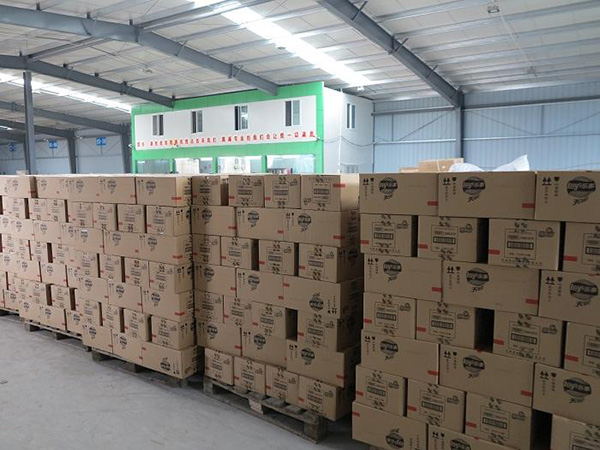
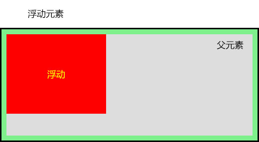
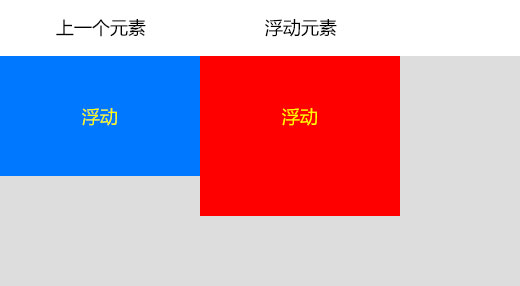
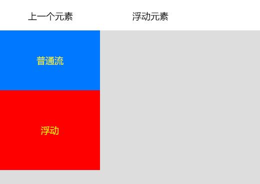
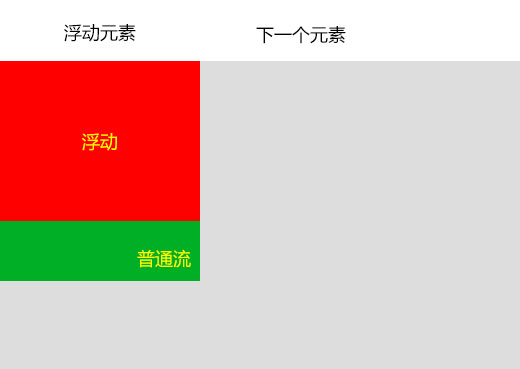

# 课程目标

- 了解网页布局的本质
- 了解定位机制
- 熟练掌握浮动属性
- 熟练掌握几种布局方法
- 熟练掌握清除浮动

# 网页布局

## 布局的本质

网页布局中，我们是如何把里面的文字、图片，按照要求排列的整齐有序呢？


生活中零散的商品如何摆放？



生活中我们把商品装到盒子里，就可以整齐的摆放和运输。在网页中我们也可以用相同的思路。

**网页布局的本质：**把网页元素，如文字、图片等，放入盒子里面，然后利用Css摆放盒子的过程，就是网页布局。


我们已经学过的盒子模型，可以把文字、图片放到盒子模型中，接下来学习如何把盒子摆放到合适的位置。

## 盒子模型

盛装网页内容如文本、图片的容器。（参考上一节课内容）

## 定位机制

Css 有三种基本的定位机制：普通文档流、浮动流和绝对定位。 

**普通流**

网页内元素正常块元素从上到下，行元素从左到右排列顺序，比如块级元素会独占一行，行内元素会按顺序依次前后排列；按照这种大前提的布局排列之下绝对不会出现例外的情况叫做普通文档流（布局），也叫标准流。

特点：固定顺序、规规矩矩、层级低

**浮动**

元素的浮动是指元素会脱离普通文档流的控制，移动到其父元素中指定位置的过程，普通流中其它元素就像浮动的元素不存在一样。 

特点：指定顺序、易出错、层级高

**绝对定位**（定位模式的一种）

定位模式中的绝对定位可以使元素到达指定位置，也会使元素的位置与普通流无关，普通流中其它元素就像绝对定位的元素不存在一样 。

特点：想去哪就去哪、层级高


# 浮动float

元素的浮动是指设置了浮动属性的元素会脱离普通文档流的控制，移动到其父元素下的指定位置的过程。

语法：

```css
float : none | left | right
```

属性值：

1. none  元素不浮动（默认值）
2. left  元素向左浮动
3. right  元素向右浮动

注意：浮动脱离普通流，不占位置，会影响普通流。

## 浮动的特性

**浮动元素和父级元素的特征**

1、浮动的元素总是找离它最近的父级元素对齐，在宽度内，但是不会超出内边距的范围。



**浮动元素和上一个元素的特征**

2、如果上一个元素有浮动，则浮动元素顶部会和上一个元素的顶部对齐；

3、如果上一个元素是普通流，则浮动元素的顶部会和上一个元素的底部对齐。





**浮动元素和下一个元素的特征**

4、浮动元素是浮起来的，不占位置，它原来的位置漏给了普通流元素。



**总结：**

1. 两个盒子要对齐显示，必须都进行浮动。其中一个盒子有浮动，则其他盒子也需要浮动，才能一行对齐显示。
2. 加了浮动的元素盒子是浮起来的，漂浮在其他的普通流盒子上面。
3. 加了浮动的元素盒子不占位置，它原来的位置给后面的普通流盒子。
4. 加了浮动的元素盒子，会具有行内块元素的特性。

# 常见网页布局

网页是从上至下阅读的，网页布局中首先要解决盒子从上至下摆放，再解决从左至右的摆放。

网页的普通流盒子即是从上至下排列，而浮动可以解决从左至右的摆放。所以网页布局中会先使用普通流元素作为父元素盒子，再使用浮动元素作为子元素盒子。

## 一列固定宽度

使用普通流布局


## 两列左窄右宽

普通流搭配浮动布局，普通流盒子里面的子盒子使用浮动


## 多列平均分布


## 布局流程

网页布局时通常需要遵守一定的布局流程，具体如下：

1、确定页面的版心（可视区）。

2、分析页面中的居于一行的大模块，以及每个行模块中的左右排列的小模块。

3、制作Html页面，Css文件。

4、Css初始化，然后开始运用盒子模型的原理，通过Div+Css布局来控制网页的各个模块。

# 解决浮动的影响

由于浮动元素不再占用原文档流的位置，所以它会对后面的元素排版产生影响，为了解决这些问题，此时就需要在该元素中清除浮动。

清除浮动主要为了解决父级元素因为子级浮动引起内部高度为0 的问题。

**注意：我们实际工作中，常常不给父级盒子设定高度，父级盒子的高度靠子盒子的高度撑开。**

## 清除浮动clear

规定元素的哪一侧不允许其他浮动元素。 

语法：

```css
clear : none | left | right | both  
```

属性值：

1. none：允许浮动元素出现在两侧 （默认值）
2. left：不允许左侧有浮动元素，即清除左侧浮动的影响
3. right：不允许右侧有浮动元素，即清除右侧浮动的影响
4. both：同时清除左右两侧浮动的影响（常用）

方法一：使用一个空标签

```css
.clear {
    clear:both;
}
```

```html
<div class="clear"></div>
```

方法二：使用换行标签

```css
.clear {
    clear:both;
}
```

```html
<br class="clear" />
```

优点：直观属性解决

缺点：增加多余空标签，影响html页面代码结构

建议：不推荐使用，此方法是以前主要使用的一种清除浮动方法，适合新手使用

## 父元素设置height

父级元素手动设置height，就解决了父级无法自动获取到高度的问题。

方法：

```css
div {
    height:150px;
}
```

优点：不影响html页面代码结构

缺点：不能适应变化的盒子内容，如文本内容增多

建议：在内容较少，高度可确定的情况下使用

## 父元素设置overflow 

使用"overflow:hidden;"或"overflow:auto;"

方法一：

```css
div {
    overflow:hidden;
}
```

方法二：

```css
div {
    overflow:auto;
}
```

优点：不影响html页面代码结构

缺点：内部宽高超过父级div时，会出现滚动条或隐藏。 

建议：不推荐使用

## 伪元素after

通过:after伪元素增加html页面代码结构，再在增加的元素上通过clear属性清除浮动

IE8以上和非IE浏览器都支持:after，zoom属性是IE浏览器专有属性，可解决IE6,IE7浮动问题 

方法：

```css
.clear:after { content:"."; display:block; height:0; clear:both; visibility:hidden; }
.clear {*zoom: 1;}   /* IE6、IE7 兼容 */
```

注意： content:"."  里面尽量跟一个小点，或者其他，尽量不要为空，否则再firefox 7.0前的版本会有生成空格。

优点：浏览器支持好，不容易出现问题，目前流行

缺点：代码多，两句代码结合使用 ，不适合初学者

建议：推荐使用
