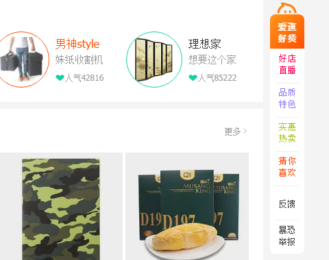
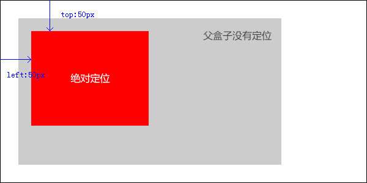
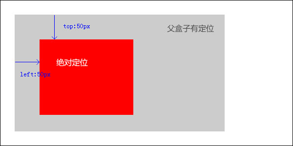

# 课程目标

- 了解定位在布局中的作用
- 熟练掌握定位属性
- 熟练掌握绝对定位的应用
- 熟练掌握固定定位的应用

# 定位的应用情况




浮动的主要目的是让多个块级元素一行显示，那么定位的主要价值就是移动位置， 让盒子到达我们想要的位置上去。

# 定位position

元素的定位属性主要包括定位模式和定位偏移两部分。

**定位模式**

语法：

```css
position : static | relative | absolute | fixed
```

属性值：

1. static ： 没有定位，默认值
2. relative ： 相对定位 
3. absolute ： 绝对定位
4. fixed ： 固定定位 

**定位偏移**

| 属性   | 描述                                           |
| ------ | ---------------------------------------------- |
| top    | 顶端偏移量，定义元素相对于其父元素上边线的距离 |
| bottom | 底部偏移量，定义元素相对于其父元素下边线的距离 |
| left   | 左侧偏移量，定义元素相对于其父元素左边线的距离 |
| right  | 右侧偏移量，定义元素相对于其父元素右边线的距离 |

**注意：定位必须要定位模式和定位偏移搭配使用。**

## 相对定位relative

相对定位是将元素相对于它原来在普通流中的位置进行定位。

参考点：元素原来的位置

案例：

```css
.box {
    position : relative;
    top : 20px;
    left : 30px;
}
```


注意：相对定位的元素虽然移动了，但他继续占有原来的位置

1. 相对定位的元素可以看做仍在普通流中，它后面的盒子仍以普通流方式对待它。
2. 相对定位的元素会覆盖其他元素。

## 绝对定位absolute

绝对定位是将元素相对于其包含元素进行定位。包含元素为html文档或者已有定位的元素。

参考点：浏览器(html文档)、已有定位的父级元素或者祖先元素

案例：

```css
.box {
    position : absolute;
    top : 20px;
    left : 30px;
}
```


注意：

1. 绝对定位脱离普通文档流，完全不占有位置。
2. 绝对定位的元素会覆盖其他元素。
3. 绝对定位的元素具有块级特性，可以设置宽高。

### 父相子绝

绝对定位的元素的位置相对于最近的已有定位的祖先元素进定位，如果元素没有已定位的祖先元素，那么它的位置相对于最初的包含块(html文档)。 

**父级没有定位**：若绝对定位元素所有父元素（祖先元素）都没有定位，以浏览器为准对齐(html文档)。



**父级有定位**：绝对定位是将元素依据最近的已经定位（绝对、固定或相对定位）的父元素（祖先）进行定位。



**父级使用相对定位**：

```css
.father {
    position : relative;
}
.father .son {
    position : absolute;
    top : 0;
    left : 0;
}
```

**在使用绝对定位的时候，一定要给他的父盒子定一个相对定位**

为了给绝对定位一个定位区域，父盒子需要设置一个定位，当给父盒子使用绝对定位或固定定位时，父盒子会脱离普通流，不会占有位置，而布局时父盒子需要占有位置，因此父盒子只能使用相对定位。 

这就是父相子绝的由来。

### 盒子水平/垂直居中

普通的盒子是左右margin 改为 auto就可， 但是对于绝对定位就无效了

定位的盒子也可以水平或者垂直居中，计算方法：

1. 首先设置偏移left:50%;即父盒子的一半大小。
2. 然后设置外边距margin-left为负数，定位盒子宽度的一半 。


案例：
```css
.box {
    width : 400px;
    position : absolute;
    left : 50%;
    margin-left : -200px; /* 定位盒子宽度的一半 */
}
```

## 固定定位fixed

固定定位是定位的一种特殊形式，它以浏览器窗口作为参照物来定位网页元素。

参考点：浏览器窗口

案例：

```css
.box {
    position : fixed;
    right : 20px;
    bottom : 30px;
}
```

注意：

1. 固定定位的元素跟父级没有任何关系，只认浏览器。
2. 固定定位完全脱离普通文档流，不占有位置，不随着滚动条滚动。
3. IE6等低版本浏览器不支持固定定位。

## 堆叠层级z-index

设置元素的堆叠顺序，拥有更高堆叠顺序的元素总是会处于堆叠顺序较低的元素的前面。 

语法：

```css
z-index : 数值
```

属性值：

1. 数值没有单位
2. 可以使用负数

案例：

```css
.box {
    position : absolute;
    z-index : 1;
}
```

注意：

1. 默认属性值是0，取值越大，定位元素在层叠元素中越居上。
2. 如果取值相同，则根据书写顺序，后来居上。
3. 后面数字一定不能加单位。
4. 只有相对定位，绝对定位，固定定位有此属性，其余标准流，浮动，静态定位都无此属性，亦不可指定此属性。

