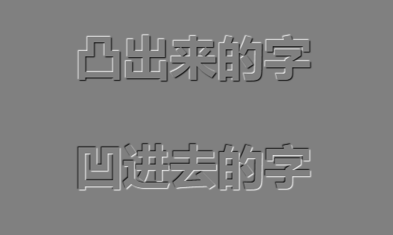
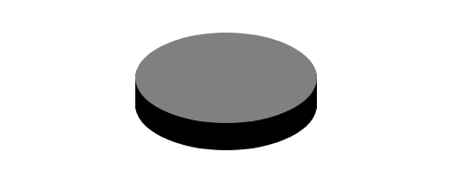
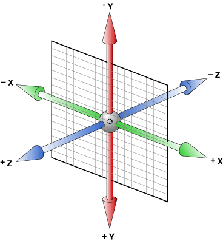

# 课程目标

- 了解CSS3的模块划分
- 熟练掌握CSS3的选择器
- 熟练掌握CSS3的文本属性
- 熟练掌握CSS3的背景和边框属性
- 熟练掌握CSS3的2D/3D转换属性
- 熟练掌握CSS3的过渡属性

# 认识CSS3

CSS3 是最新的 CSS 标准。

CSS3 完全向后兼容，因此您不必改变现有的设计。浏览器通常支持 CSS2。

## CSS3模块

CSS3 被划分为模块。

一些最重要CSS3模块如下：

- 选择器
- 盒子模型
- 背景和边框
- 文本效果
- 2D/3D 转换
- 动画
- 多列布局
- 用户界面

## 浏览器支持

W3C 仍然在对 CSS3 规范进行开发。不过，现代浏览器已经实现了相当多的 CSS3 属性。

# 选择器

## 结构伪类选择器 

1. **:first-child** 选择属于父元素的第一个子元素。（CSS2）

**语法**：

```css
ul li:first-child { }
```

2. **:last-child **选择属于父元素的最后一个子元素。 

**语法**：

```css
ul li:last-child { }
```

3. **:nth-child(n)** 选择属于其父元素的第n个子元素。 

**语法**：

```css
ul li:nth-child(2) { }
```

## 伪元素选择器

1. **:before **在被选元素的内容前面插入内容。 使用 **content** 属性来指定要插入的内容 。（CSS2）

```css
p:before {
    content:"我不在html内";
}
```

2. **:after** 在被选元素的内容后面插入内容。 使用 **content** 属性来指定要插入的内容 。（CSS2）

```css
p:after {
    content:"我不在html内";
}
```

# 文本效果

| 属性          | 值                     | 描述                               |
| ------------- | ---------------------- | ---------------------------------- |
| text-shadow   | x位置 y位置  模糊 颜色 | 设置文本阴影，可使用多个阴影       |
| text-overflow | clip\|ellipsis         | 规定当文本溢出包含元素时发生的事情 |

案例：使用文本阴影制作立体感文字



# 背景和边框

| 属性             | 值                               | 描述                           |
| ---------------- | -------------------------------- | ------------------------------ |
| background-image | url(URL),url(URL)                | 使用多个背景图像               |
| background-size  | 像素值\|%                        | 设置背景图片的尺寸             |
| border-radius    | 像素值\|%                        | 设置盒子的圆角边框（顺时针）   |
| box-shadow       | x位置 y位置  模糊 尺寸 颜色 内外 | 设置盒子的阴影，可使用多个阴影 |

案例：使用盒子阴影制作圆柱体



# 透明度opacity

设置元素的不透明级别。

语法：

```css
opacity: value ;
```

属性值：

value : 从 0.0 （完全透明）到 1.0（完全不透明） 

浏览器兼容：

IE8 以及更早的版本支持替代的 filter 属性。例如：filter:Alpha(opacity=50)。 

# 2D/3D转换transform

设置元素 2D 或 3D 转换。该属性允许我们对元素进行旋转、缩放、移动或倾斜。 



## 移动元素translate()

| 转换方法       | 描述                         |
| -------------- | ---------------------------- |
| translate(x,y) | 根据 x坐标 和 y坐标 移动位置 |
| translateX(n)  | 根据 x坐标 移动位置          |
| translateY(n)  | 根据 y坐标 移动位置          |


## 缩放元素scale()

| 转换方法   | 描述                                      |
| ---------- | ----------------------------------------- |
| scale(x,y) | 根据倍数改变元素的宽度和高度，1为基准倍数 |
| scaleX(n)  | 根据倍数改变元素的宽度，1为基准倍数       |
| scaleY(n)  | 根据倍数改变元素的高度，1为基准倍数       |


## 倾斜元素skew()

| 转换方法              | 描述                                |
| --------------------- | ----------------------------------- |
| skew(x-angle,y-angle) | 根据 x轴 和 y轴 翻转给定的角度(deg) |
| skewX(angle)          | 根据 x轴 翻转给定的角度(deg)        |
| skewY(angle)          | 根据 y轴 翻转给定的角度(deg)        |


## 旋转元素rotate()

| 转换方法              | 描述                                            |
| --------------------- | ----------------------------------------------- |
| rotate(angle)         | 顺时针旋转给定的角度(deg)，使用负值将逆时针旋转 |
| rotate3d(x,y,z,angle) | 根据 x坐标 、 y坐标 、z坐标 旋转给定的角度(deg) |
| rotateX(angle)        | 根据 x坐标 旋转给定的角度(deg)                  |
| rotateY(angle)        | 根据 y坐标 旋转给定的角度(deg)                  |
| rotateZ(angle)        | 根据 z坐标 旋转给定的角度(deg)                  |


# 过渡transition

设置元素从一种样式（属性）变换为另一种样式（属性）时为元素添加效果。

语法：

```css
transition : 属性名称 持续时间 缓动 延迟时间 
```

属性值：

- 属性名称：设置过渡效果的 CSS 属性的名称 
- 持续时间：过渡效果需要多少秒或毫秒 
- 缓动：过渡效果的速度曲线 ，linear | ease | ease-in  ease-out | ease-in-out 
- 延迟时间：过渡效果何时开始。 

案例：

```css
div {
    width:100px;
    transition: width 2s ease;
}
div:hover {
    width:300px;
}
```

拆分属性：

| 属性                       | 属性值                                             | 描述                          |
| -------------------------- | -------------------------------------------------- | ----------------------------- |
| transition-property        | 属性的名称                                         | 设置过渡效果的 CSS 属性的名称 |
| transition-duration        | s（秒）                                            | 过渡效果需要多少秒或毫秒      |
| transition-timing-function | linear \| ease \| ease-in  ease-out \| ease-in-out | 过渡效果的速度曲线            |
| transition-delay           | s（秒）（为0时要带单位，0s）                       | 过渡效果何时开始              |

案例：鼠标经过改变图片大小

# 动画

## 动画规则@keyframes

语法：

```css
@keyframes 动画名称 {
    时间轴 {
        css-styles;
    }
}
```

时间轴：

- 0%-100%，0% 是动画的开始时间，100% 动画的结束时间。

- from（与 0% 相同）
- to（与 100% 相同）

## 动画属性animation

语法：

```css
animation: 动画名称 时间 速度曲线 延迟时间 播放次数 反向播放;
```

| 属性                      | 属性值            | 描述                             |
| ------------------------- | ----------------- | -------------------------------- |
| animation-name            |                   | 绑定到选择器的 keyframe 名称。   |
| animation-duration        | s（秒）           | 动画所花费的时间，以秒或毫秒计。 |
| animation-timing-function |                   | 动画的速度曲线。                 |
| animation-delay           | s（秒）           | 动画何时开始。                   |
| animation-iteration-count | 数值 \| infinite  | 动画播放的次数。                 |
| animation-direction       | alternate         | 动画是否应该轮流反向播放。       |
| animation-play-state      | paused \| running | 动画正在运行还是暂停。           |
