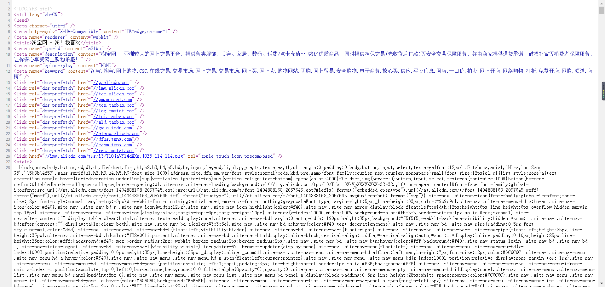
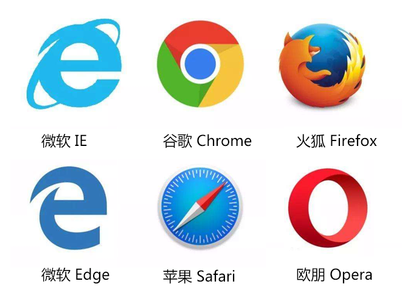
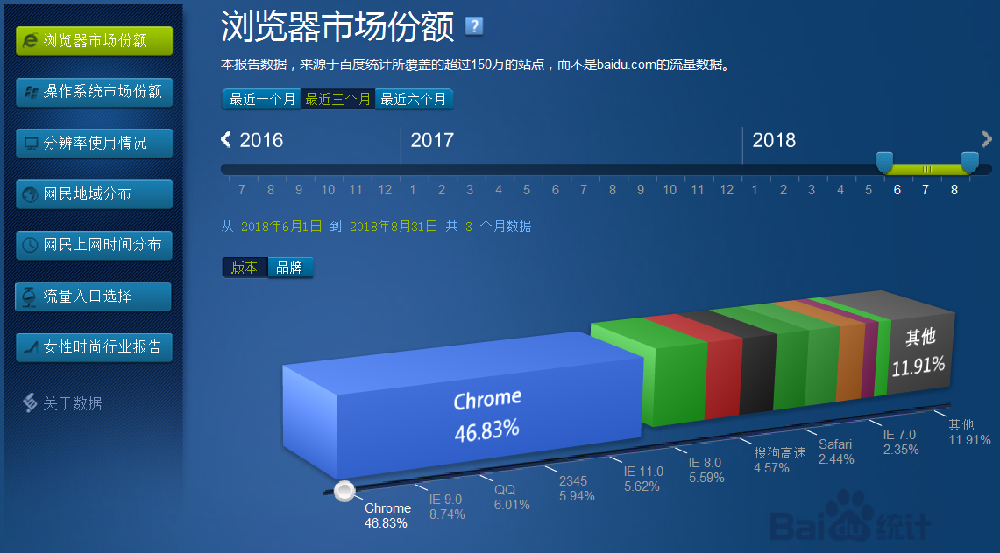
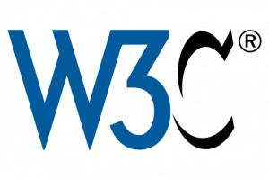
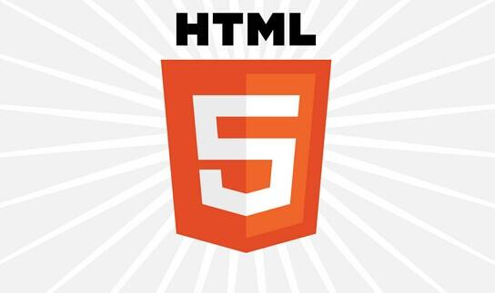
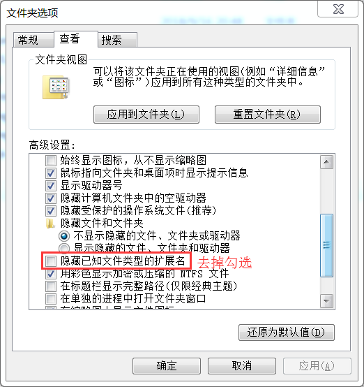

# 认识网页
**平时大家上网喜欢做什么**：
- 购物
- 玩游戏
- 看电影、听音乐
- 看新闻

**普通用户看到的网页**


**转换身份：**  
**普通用户=>开发人员**

**网页里包含什么**
- 文字
- 图片
- 视频
- 音频
- 链接
- js特效
- flash

**开发人员看到的网页**
>我们作为网站开发者看到的网页是怎么样的呢？

  

**思考：代码如何成为网页?**

# 浏览器
## 常见浏览器
>普通用户常见的浏览器有哪些？

- Internet Explorer
- 360浏览器
- QQ浏览器
- 2345浏览器
- 搜狗浏览器
- 谷歌浏览器
- 火狐浏览器
- ……

## 浏览器的五大产商
>浏览器是网页运行的平台,五大浏览器厂商：微软 （IE）、谷歌（Chrome）、火狐（Firefox）、苹果（safari）、Opera

 
- 微软 IE浏览器
- 微软 Edge浏览器
- 苹果 safari浏览器
- 谷歌 Chrome浏览器
- 火狐 Firefox浏览器
- 欧朋 Opera浏览器

## 市场占有份额
>有这么多浏览器，到底哪个浏览器最好呢？我们来看看
[浏览器市场占有份额](http://tongji.baidu.com/data/browser  "浏览器份额")



**推荐使用谷歌Chrome浏览器**

## 浏览器内核
1. Trident(IE内核)：该内核程序在1997年的IE4中首次被采用，是微软在Mosaic代码的基础之上修改而来的，并沿用到IE11，也被普遍称作”IE内核”。
2. Gecko(Firefox)：开源内核，代码完全公开，因此，其可开发程度很高，全世界的程序员都可以为其编写代码，增加功能。
3. webkit(safari)：开源内核，苹果公司自己的内核，也是苹果的Safari浏览器使用的内核。Chrome内核的原型，WebKit 内核在手机上的应用也十分广泛。
4. Chromium/Bink(chrome)：Blink是一个由Google和Opera Software开发的浏览器排版引擎，在Chrome（28及往后版本）、Opera（15及往后版本）中使用。谷歌当时采用苹果的Webkit核心打造了Chrome浏览器。Opera也宣布称将会转向Webkit核心，但是谷歌宣布此举后，Opera表示将会跟随谷歌采用其Blink浏览器核心，同时参与了Blink的开发。
5. Presto（Opera）：Opera12.17及更早版本曾经采用的内核，现已停止开发并废弃，该内核在2003年的Opera7中首次被使用，该款引擎的特点就是渲染速度的优化达到了极致，然而代价是牺牲了网页的兼容性。Opera现已改用Google Chrome的Blink内核。

# Web标准
## W3C组织
>万维网联盟是国际最著名的标准化组织,1994年10年成立后，至今已发布近百项相关万维网的标准,对万维网发展做出了杰出的贡献。万维网联盟拥有来自全世界40个国家的400多个会员组织，已在全世界16个地区设立了办事处。2006年4月28日，万维网联盟在中国内地设立首个办事处。



- W3C 指万维网联盟(World Wide Web Consortium)
- W3C 的工作是对 WEB 进行标准化
- W3C 创建并维护 WWW 标准
- W3C 标准被称为 W3C 推荐

## 网页主要应用的标准
>WEB标准提倡结构（Structure）、表现（Presentation）和行为（Behavior）相分离；对应我们的HTML结构、CSS表现、JavaScript行为。

1. **结构标准**
   - HTML：Web 上的通用标记语言
   - XHTML：HTML到XML之间到过渡版本，更严格的通用标记语言
2. **表现标准**
   - CSS：层叠样式表描述文档如何被显示，如字体大小、颜色。
3. **行为标准**
   - DOM 是Document Object Model文档对象模型的缩写，允许程序访问并更改文档的内容、结构和样式。
   - ECMAScript 是ECMA(European Computer Manufacturers Association)制定的标准脚本语言（JAVAScript）

**直观感受**


# Html
## 什么是Html
>HTML 是用来描述网页的一种语言。

- HTML 指的是超文本标记语言 (Hyper Text Markup Language)
- HTML 不是一种编程语言，而是一种标记语言 (markup language)
- 标记语言是一套标记标签 (markup tag)
- HTML 使用标记标签来描述网页

## Html的历史
- HTML没有1.0版本是因为当时有很多不同的版本。
- 1995年HTML有了第二版，即HTML2.0
- 1996年HTML3.2成为W3C推荐标准
- 之后在1997年和1999年，作为升级版本的4.0和4.01也相继成为W3C的推荐标准
- HTML5——2014年10月28日，W3C推荐标准



## 初识Html标签  
浏览器不会显示html标签，它会解读HTML文档  
**对比区别**
```
标签
strong 标签 strong
<strong> 标签 </strong>
```

## Html文档
**Html文档的格式**  
Html文档的后缀名是：.html或者.htm

**推荐在电脑上打开扩展名显示**



**Html文档的结构**

```
<! DOCTYPE html>
<html>
    <head></head>
    <body><body>
</html>
```

**标签解释**  
`<html></html>`之间的文本描述网页  
`<head></head>`之间的文本是不可见的描述网页信息  
`<body></body>`之间的文本是可见的页面内容

## 我的第一个网页
**使用文本文档制作第一个网页**
1. 新建文本文档
2. 修改文本文档扩展名为“.html”
3. 使用记事本编辑文档，输入Html文档基本结构
4. 使用`<title>`标签添加网页标题，在`<body>`标签内添加内容
5. 保存文件后，使用浏览器打开网页查看效果