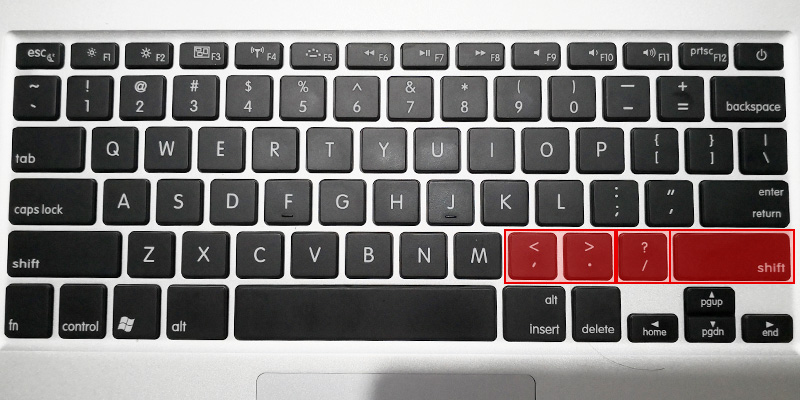
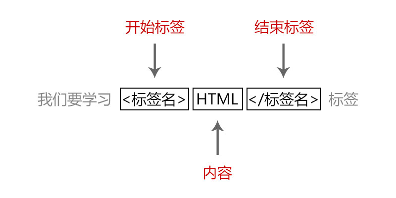
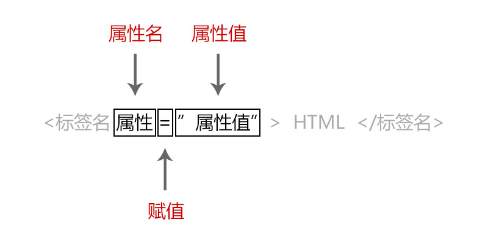
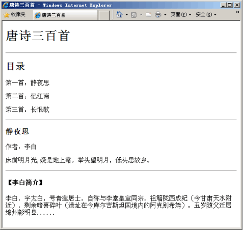

# Html语法
## Html标签
**标签的作用**
>在前面的课程我们分析了网页内容，了解到网页的内容有
- 文字
- 图片
- 音频
- 视频
- 动画
- ……

我们需要用代码表示出这些文字、图片等内容，用来表示这些内容的代码就是“标签”。  
开发人员用代码将网页内容表示出来，通过浏览器解析出普通用户看到到网页内容。

**标签形式**  
带有`<>`（尖括号）的特定文字被称为Html标签。  
如：
```
<html></html>
```  
- 放在`<>`中
- 表示某个功能的编码
- `/`斜杆符号表示闭合（结束）

**键盘位置**  


**双标签**
```
<body></body>
```
- 开始标签（start tag）
- 结束标签（end tag）

**单标签**  
单标签也叫空标签
```
<br />
<hr />
```
- 自带闭合斜杆`/`

## Html元素
>HTML元素指的是从开始标签（start tag）到结束标签（end tag）的所有代码。



**代码片段**
```
我要学习<strong>HTML</strong>标签
```

**使用小写标签**  
万维网联盟（W3C）在 HTML 4 中推荐使用小写，而在 XHTML 版本中强制使用小写

**不要忘记结束标签**  
即使您忘记了使用结束标签，大多数浏览器也会正确地显示 HTML，但忘记使用结束标签会产生不可预料的结果或错误。

**空元素**  
没有内容的 HTML 元素被称为空元素。
- 双标签中间没有内容
- 单标签自带闭合

## Html元素的关系
>大多数 HTML 元素可以嵌套，即可以包含其他 HTML 元素，HTML 文档由嵌套的 HTML 元素构成。

### 嵌套关系
- 父级元素
- 子级元素
- 后代元素
```
<html>
  <head>
    <title></title>
  </head>
  <body></body>
</html>
```

### 并列关系
- 兄弟元素
```
<head></head>
<body></body>
```

## Html元素的属性


**代码片段**
```
<body bgcolor=“red”></body>
```
- 用于开始标签 或者 单标签 上
- 等于号`=`表示赋值
- 属性值写在双引号`""`中间

### 全局属性
在每个标签中都可以使用的属性
```
<body class="#"></body>
<body id="#"></body>
```

### 专有属性
只能在某个标签或者部分标签中才能使用的属性  
```
<a href="#"></a>
  
```

### 使用多个属性
一个标签可以使用多个属性
```

```

# Html基本标签
## 标题标签
定义标题`<hx></hx>`
```
<h1>一级标题</h1>
<h2>二级标题</h2>
<h3>三级标题</h3>
<h4>四级标题</h4>
<h5>五级标题</h5>
<h6>六级标题</h6>
```
## 段落标签
定义段落`<p></p>`
```
<p>这是一个段落</p>
```
## 换行标签
定义换行`<br />`
```
我要马上要另起一行了<br />
这是新的一行
```
## 水平线标签
定义水平线`<hr />`，可以在视觉上将文档分隔成各个部分。
```
<p>这是一个段落</p>
<hr />
<p>这是另一个段落</p>
```
- 在 HTML 中，`<hr>` 标签没有结束标签。
- 在 XHTML 中，`<hr>` 必须被正确地关闭，比如 `<hr />`。

## 文本格式化标签
|标签|标签|区别|
|-|-|-|
|加粗|`<b></b>`  `<strong></strong>` |推荐使用`<strong></strong>`|
|斜体|`<i></i>` `<em></em>` |推荐使用`<em></em>`|
|删除线|`<s></s>` `<del></del>` |推荐使用`<del></del>`|
|下划线|`<u></u>` `<ins></ins>` |不赞成使用`<u></u>`|

# 作业练习：唐诗三百首

