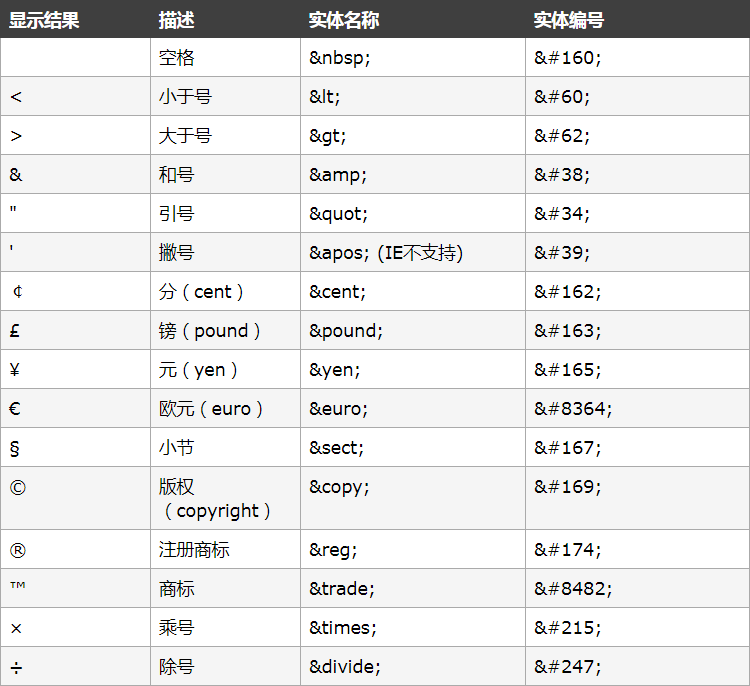

# Html字符实体
在 HTML 中，某些字符是预留的，必须被替换为字符实体。注意：实体名称对大小写敏感！  

**空格**  
如需在页面中增加空格的数量，需要使用 `&nbsp;` 字符实体。  

**小于号大于号**  
在 HTML 中不能使用小于号（<）和大于号（>），这是因为浏览器会误认为它们是标签。  
需要使用`&lt;`,`&gt;`  

**元**(&yen;) `&yen;`  

**版权**(&copy;) `&copy;`  

**更多常用字符**  

# Html注释
注释标签 `<!-- 与 -->` 用于在 HTML 插入注释
```
<!-- 在此处写注释 -->
```
**用注释说明代码**
```
<!-- 这是一个段落 -->
<p>对，这是一个段落</p>
```
**用注释调试代码**  
```
<!-- <h1>也许这里有错误，影响了整个网页</b></h1> -->
```
**条件注释**
```
<!--[if IE 8]>
    只有 IE8 浏览器会执行
<![endif]-->
```
条件注释只能在IE下使用

# Html超链接
HTML 使用超级链接与网络上的另一个文档相连。
```
<a href="url">链接文本</a>
```

**href属性**：规定链接的目标
```
<a href="http://www.baidu.com">百度搜索</a>
```
"链接文本" 不必一定是文本。图片或其他 HTML 元素都可以成为链接。

**target属性**：用来设置打开页面的方式  
- _self：在本页面打开
- _blank ：在新页面打开
- _top：在本页面的顶层框架打开
- _parent ：在本页面的上层框架打开

**锚链接** ：跳转至通过name属性或id属性创建的锚点 

```
<a href="#name">锚链接</a>
<p name="name"></p>
```
# Html插入图片
图片标签``定义图像，单标签（自闭和标签）
```

```

**源属性: src**
- 本地图片
- 网络图片
- base64图片

**宽度属性: width，高度属性: height**
```

```
- 按图片实际宽高比例设置属性值，否则图片变形
- 不超出实际宽高最大值，否则图片不清晰
- 如果只设置了其中一个属性，另一个属性会随着等比例缩放

**替换文本属性: alt**  
当图片不显示时，显示替换文本
```

```

**标题属性: title**  
当鼠标悬停在图片上时，显示图片标题
```

```
# 路径
网页需要找图像，就需要通过路径找到它
## 相对路径
- 图像和Html文件在同一个文件夹，只需要输入图像名称。
- 图像在Html文件的下一级文件夹，输入文件夹名字和文件名，“/”表示一层文件夹
- 图像在Html文件的上一级文件夹，在文件名之前加上“../”

## 绝对路径
- 本地图片：“C:\Users\Admin\Desktop\logo.png”
- 网络图片：“http://chuanzhiit.com/logo.png”

# Html列表

## 无序列表
**使用ul-li标签**
```
<ul>
  <li></li>
  <li></li>
  <li></li>
</ul>
```
**type属性**：设置li标签前面的图形形状，一共有3种
1. disc： 默认值，实心圆
2. circle：空心圆
3. square： 实心方块

## 有序列表
使用ol-li标签
```
<ol>
  <li></li>
  <li></li>
  <li></li>
</ol>
```
**type属性**：设置排序显示规则
1. 阿拉伯数字,默认值
2. 小写字母 type="a"
3. 大写字母 type="A"
4. 罗马小写字母 type="I"
5. 罗马大写字母 type="i"

**start属性**：设置开始的位置
1. 只有type属性为阿拉伯数字的时候，才有效

## 定义列表
使用dl-dt-dd标签
```
<dl>
  <dt></dt>
  <dd></dd>
  <dd></dd>
</dl>
```
## 嵌套列表
列表项内部可以使用段落、换行符、图片、链接以及其他列表等等  
```
<ul>
    <li>
        <ul>
            <li></li>
            <li></li>
            <li></li>
        </ul>
    </li>
    <li></li>
    <li></li>
</ul>
```