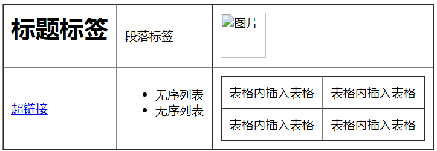

# Html表格
## 认识Html表格
**我们接触过的表格**
1. 现实中的表格
2. 办公软件Word中插入的表格
3. 办公软件Excel表格处理软件

**html表格**  
简单的Html表格由`<table>`以及一个或多个`<tr>`、`<td>`组成  
`<table>`定义表格区域  
`<tr>`定义表格的行  
`<td>`定义表格的单元格
```
<table>
  <tr>
    <td>单元格一</td>
    <td>单元格二</td>
    ……
  </tr>
  <tr>
    <td>单元格一</td>
    <td>单元格二</td>
    ……
  </tr>
  ……
</table>
```
- 定义表格不是只有一个标签，是一整套标签
- 双标签
- 没有专门定义列的标签

**实例**：创建一个三行三列表格
```
<table>
  <tr>
    <td>姓名</td>
    <td>性别</td>
    <td>职业</td>
  </tr>
  <tr>
    <td>张三</td>
    <td>男</td>
    <td>教师</td>
  </tr>
  <tr>
    <td>李四</td>
    <td>男</td>
    <td>医生</td>
  </tr>
</table>
```

## 表格的属性
**常用表格的属性**

|属性|属性值|说明|
|:-|:-|:-|
|width|数值/%|表格的宽度|
|height|数值/%|表格的高度|
|border|正整数|表格的边框|
|cellspacing|数值/%|单元格间距|
|cellpadding|数值/%|单元格内边距|
|align|left/center/right|表格水平对齐方式,不赞成使用|

**实例**
```
<table width="600" height="600" border="1" cellspacing="0" cellpadding="20" align="center">
  <tr>
    <td>姓名</td>
    <td>性别</td>
    <td>职业</td>
  </tr>
  <tr>
    <td>张三</td>
    <td>男</td>
    <td>教师</td>
  </tr>
  <tr>
    <td>李四</td>
    <td>男</td>
    <td>医生</td>
  </tr>
</table>
```

## 表格的结构
**常用表格标签**

|表格标签|说明|
|-|:-|
|`<table>`|定义表格|
|`<tr>`|定义表格的行|
|`<td>`|定义表格单元格|
|`<th>`|定义表格的表头单元格|
|`<caption>`|定义表格的标题|
|`<thead>`|定义表格的页眉（表头）|
|`<tbody>`|定义表格的主体|
|`<tfoot>`|定义表格的页脚（底部）|

**表格的标题**  
`<caption>`定义表格的标题，必须紧随 table 标签之后。您只能对每个表格定义一个标题。通常这个标题会被居中于表格之上
```
<table>
  <caption>表格的标题</caption>
</table>
```

**表格的表头**  
`<thead>`定义表格的页眉（表头），用于组合 HTML 表格的表头内容  
`<th>`定义表格的表头单元格
```
<table>
  <thead>
    <tr>
      <th>姓名</th>
      <th>性别</th>
      <th>职业</th>
    </tr>
  </thead>
</table>
```

**表格的主体**  
`<tbody>`定义表格的主体，用于组合 HTML 表格的主体内容
```
<table>
  <tbody>
    <tr>
      <td>张三</td>
      <td>男</td>
      <td>教师</td>
    </tr>
    <tr>
      <td>张三</td>
      <td>男</td>
      <td>教师</td>
    </tr>
  </tbody>
</table>
```
- 必须在`<table>`内部使用这些标签
- `<thead>` 内部必须拥有 `<tr>` 标签

## 合并单元格
**夸行合并**  
属性rowspan声明夸行合并，同一列内单元格从上至下合并
```
<table>
  <tbody>
    <tr>
      <td rowspan="2">301</td>
      <td>张三</td>
      <td>男</td>
      <td>教师</td>
      <td>123456789</td>
    </tr>
    <tr>
      <td>张三</td>
      <td>男</td>
      <td>教师</td>
      <td>123456789</td>
    </tr>
  </tbody>
</table>
```
**跨列合并**  
属性colspan声明夸列合并，同一行内单元格从左至右合并
```
<table>
  <tbody>
    <tr>
      <td>301</td>
      <td>张三</td>
      <td>男</td>
      <td colspan="2">教师123456789</td>
    </tr>
    <tr>
      <td>301</td>
      <td>张三</td>
      <td>男</td>
      <td>教师</td>
      <td>123456789</td>
    </tr>
  </tbody>
</table>
```
## 表格内的标签  
- 单元格`<td>`可以包含文本、图片、列表、段落、表单、水平线、表格等等
- 表格标签中除单元格`<td>`外的标签内部不可包含其他标签

**实例**
```
<table border="1" cellspacing="0" cellpadding="10">
  <tbody>
    <tr>
      <td><h1>标题标签</h1></td>
      <td><p>段落标签</p></td>
      <td></td>
    </tr>
    <tr>
      <td><a href="#">超链接</a></td>
      <td>
        <ul>
          <li>无序列表</li>
          <li>无序列表</li>
        </ul>
      </td>
      <td>
        <table border="1" cellspacing="0" cellpadding="10">
          <tbody>
            <tr>
              <td>表格内插入表格</td>
              <td>表格内插入表格</td>
            </tr>
            <tr>
              <td>表格内插入表格</td>
              <td>表格内插入表格</td>
            </tr>
          </tbody>
        </table>
      </td>
    </tr>
  </tbody>
</table>
```
**效果**  
