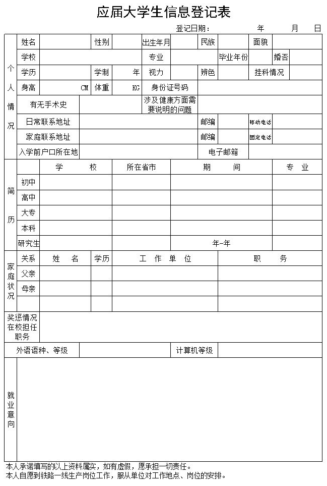

# Html表单
## 认识表单
**现实中的表单**  


**网页上的表单**  


**作用**：
与用户交互，收集用户资料，需要使用表单  

**表单组成**
1. 表单控件  
表单的主要功能，输入框、选项框、按钮等
2. 提示信息  
解释说明性文字，提示用户如何填写。
3. 表单域  
相当于一张纸，用来容纳所有的表单控件和提示信息，通过他可以定义表单数据与服务器之间的传递。

## input控件
`<input />`标签有很多形态，根据不同的 type 属性。
```
<input type="属性值" />
```
- 单标签
- 必须要使用"type"属性

**主要属性**

|属性|属性值|功能描述|
|-|-|-|
|type|text|单行文本输入框|
| |password|密码输入框|
| |radio|单选框|
| |checkbox|复选框|
| |button|普通按钮|
| |submit|提交按钮|
| |reset|重置按钮|
| |image|图像形式的提交按钮|
| |file|文件域|
|name|自定义|控件的名称|
|value|自定义|默认文本或控件值|
|size|正整数|显示宽度|
|checked|checked|默认选中项|
|maxlength|正整数|允许输入的最大字符数|

### 文本输入
`<input type="text" />` 定义用于文本输入的单行输入框

**实例**：
```
用户名：<br />
<input type="text" />
```
**效果**：
<form>
用户名：<br />
<input type="text" />
</form>

### 密码输入
`<input type="password" />` 定义用于密码输入的单行输入框（默认宽度为 20 个字符）

**实例**：
```
用户名：<br />
<input type="text" /><br />
密码：<br />
<input type="password" />
```
**效果**：
<form>
用户名：<br />
<input type="text" /><br />
密码：<br />
<input type="password" />
</form>

### 单选框
`<input type="radio" />` 定义单选框

**实例**：
```
<input type="radio" name="sex" checked="checked" />&nbsp;&nbsp;男<br />
<input type="radio" name="sex" />&nbsp;&nbsp;女<br />
<input type="radio" name="sex" />&nbsp;&nbsp;未知
```
**效果**：
<form>
<input type="radio" name="sex" checked="checked" />&nbsp;&nbsp;男<br />
<input type="radio" name="sex" />&nbsp;&nbsp;女<br />
<input type="radio" name="sex" />&nbsp;&nbsp;人妖
</form>

**name属性**

**checked属性**


### 复选框
`<input type="checkbox" />` 定义复选框

**实例**：
```
<input type="checkbox" name="eat" checked="checked" />&nbsp;&nbsp;煎蛋<br />
<input type="checkbox" name="eat" />&nbsp;&nbsp;煎饼果子<br />
<input type="checkbox" name="eat" />&nbsp;&nbsp;肉夹馍
```
**效果**：
<form>
<input type="checkbox" name="eat" checked="checked" />&nbsp;&nbsp;煎蛋<br />
<input type="checkbox" name="eat" />&nbsp;&nbsp;煎饼果子<br />
<input type="checkbox" name="eat" />&nbsp;&nbsp;肉夹馍
</form>

**name属性**

**checked属性**

### 普通按钮
`<input type="button" />` 定义普通按钮（多数情况下，用于通过 JavaScript 启动脚本）

**实例**：
```
<input type="text" /><input type="button" value="搜索" />
```
**效果**：
<input type="text" /><input type="button" value="搜索" />

**value属性**

### 提交按钮
`<input type="submit" />` 定义用于提交表单数据至表单处理程序的按钮

**实例**：
```
用户名：<br />
<input type="text" /><br />
密码：<br />
<input type="password" /><br /><br />
<input type="submit" />
```
**效果**：
<form>
用户名：<br />
<input type="text" /><br />
密码：<br />
<input type="password" /><br /><br />
<input type="submit" />
</form>

### 重置按钮
`<input type="reset" />` 定义用于清空表单控件数据的按钮

**实例**：
```
用户名：<br />
<input type="text" /><br />
密码：<br />
<input type="password" /><br /><br />
<input type="submit" />&nbsp;&nbsp;<input type="reset" />
```
**效果**：
<form>
用户名：<br />
<input type="text" /><br />
密码：<br />
<input type="password" /><br /><br />
<input type="submit" />&nbsp;&nbsp;<input type="reset" />
</form>

### 图像形式的提交按钮
`<input type="image" src="图片" />` 定义图片形式的提交按钮

**实例**：
```
<input type="image" src="images/btn-img.png" />
```
**效果**：
<form>
<input type="image" src="images/btn-img.png" />
</form>

### 文件域
`<input type="file" />` 定义输入字段和 "浏览"按钮，供文件上传

**实例**：
```
上传文件:<br />
<input type="file" />
```
**效果**：
<form>
上传文件:<br />
<input type="file" />
</form>

## label标签
`<label>` 标签为 `<input />` 定义标注（标记）

**方法一：直接包含**  
`<label>`包裹住 `<input />` 控件和提示文字

**实例**
```
<label>
  <input type="radio" name="sex" />女生
</label>
<br />
<label>
  <input type="radio" name="sex" />男生
</label>
```
**效果**
<form>
  <label>
    <input type="radio" name="sex" />女
  </label>
  <br />
  <label>
    <input type="radio" name="sex" />男
  </label>
</form>

**方法二：使用for属性关联**  
使用 "for" 属性，把 "for" 属性的值设置为相关控件的 id 属性的值。

**实例**
```
<input type="radio" name="sex" id="woman" /><label for="woman">女生</label>
<br />
<input type="radio" name="sex" id="man" /><label for="man">男生</label>
```
**效果**
<form>
<input type="radio" name="sex" id="woman" /><label for="woman">女生</label>
<br />
<input type="radio" name="sex" id="man" /><label for="man">男生</label>
</form>

> **id属性**：
> 1. 每个元素都可以添加id属性
> 2. id属性的值在页面中必须是唯一的

## textarea文本域
`<textarea>`定义多行的文本输入控件。

**属性**  
可以通过 cols 和 rows 属性来规定 textarea 的尺寸，不过更好的办法是使用 CSS 的 height 和 width 属性。

**实例**
```
<textarea cols="20" rows="5">
</textarea>
```
**效果**
<form>
  <textarea cols="50" rows="5">
  </textarea>
</form>

## button按钮
`<button>`定义按钮。

**属性**  
"type" 规定按钮的类型，类型有button、submit、reset。

**实例**
```
<button type="button">普通按钮</button>
<br /><br />
<button type="submit">提交按钮</button>
<br /><br />
<button type="reset">重置按钮</button>
```
**效果**
<form>
  <button type="button">普通按钮</button>
  <br /><br />
  <button type="submit">提交按钮</button>
  <br /><br />
  <button type="reset">重置按钮</button>
</form>

**注意：请在 HTML 表单中使用 input 元素来创建按钮**  
在 HTML 表单中使用 button 元素，不同的浏览器会提交不同的值。Internet Explorer 将提交 `<button>` 与 `</button>` 之间的文本，而其他浏览器将提交 value 属性的内容。请在 HTML 表单中使用 input 元素来创建按钮。

## select下拉列表
`<select>`定义下拉列表  
`<option>`定义下拉列表中待选择的选项

**实例**
```
<select>
  <option>选项一</option>
  <option>选项二</option>
  <option>选项三</option>
  <option>选项四</option>
</select>
```
**效果**
<form>
  <select>
    <option>选项一</option>
    <option>选项二</option>
    <option>选项三</option>
    <option>选项四</option>
  </select>
</form>
 
**属性**：  
1. **size属性**：设置显示选项个数，属性值正整数。
2. **multiple属性**：设置是否开启多选，属性值 "multiple"，按住ctrl单击课多选。
3. **selected属性**：设置默认选中项，属性值 "selected"，在`<option>`中使用。

**实例**
```
<select size="3" multiple="multiple">
  <option selected="selected">选项一</option>
  <option>选项二</option>
  <option>选项三</option>
  <option>选项四</option>
</select>
```
**效果**
<form>
  <select size="3" multiple="multiple">
    <option selected="selected">选项一</option>
    <option>选项二</option>
    <option>选项三</option>
    <option>选项四</option>
  </select>
</form>

## 表单域
`<form>`定义表单域，表单域用来容纳所有的表单控件和提示信息，通过他可以定义表单数据与服务器之间的传递。

**action属性**：  
1. 设置表单数据的接收地址
2. get方式下如果没有设置地址，会把参数添加到当前页的url上并自动刷新页面

**method属性**：设置表单数据传送的方式，表单数据将通过 method 属性附加到 URL 上 
1. "get"方式，直接在一个传输步骤中发送所有的表单数据，浏览器会将数据直接附在表单的 action URL 之后。这两者之间用问号(?)进行分隔。
   - 传输简短数据
   - 传输快
   - 安全性较低
2. "post"方式：将数据作为单独的事务传输给服务器进行处理，可以在其中采用加密的方法。
   - 传输复杂数据
   - 传输慢
   - 安全性较高

```
<form action="jieshou.php" method="get" >
  姓名：<input type="text" />
  <br />
  <input type="submit" value="Submit" />
</form>
```
